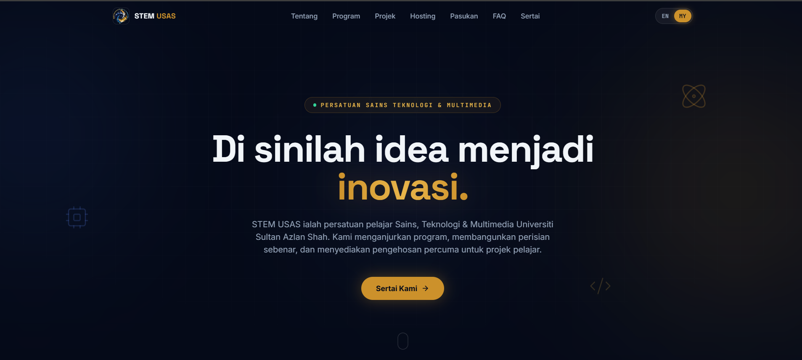

# STEM USAS Landing Page



Welcome to the official web repository for **Persatuan Sains, Teknologi & Multimedia (STEM) Universiti Sultan Azlan Shah (USAS)**. 

This project is a high-performance, single-page application (SPA) designed to showcase the club's initiatives, active projects, and to facilitate new member registrations and web hosting requests.

## Core Features
* **Bilingual Support:** Fully localized in English (EN) and Bahasa Malaysia (MS).
* **Glassmorphic UI:** High-end modern styling with glowing gradients and backdrop blurs.
* **Smooth Scrolling:** Powered by Lenis for buttery-smooth scrolling physics.
* **Responsive Design:** Fully optimized for mobile, tablet, and desktop viewing.
* **Easter Eggs:** Secret interactive elements hidden for the tech-savvy.

## Tech Stack

**Frontend Architecture**
- [React 18](https://reactjs.org/)
- [Vite](https://vitejs.dev/)
- [Tailwind CSS 3](https://tailwindcss.com/)
- [TypeScript](https://www.typescriptlang.org/)
- [Lenis](https://lenis.studiofreight.com/)

## Getting Started

> **Detailed Setup Guide:** For an in-depth walkthrough of setting up the environment, please see our comprehensive [Installation Guide](INSTALLATION.md).

Follow these quick steps to get a local copy of the STEM USAS landing page up and running.

### Prerequisites
* Node.js (v18.0.0 or higher recommended)
* npm, yarn, or pnpm
* Git

### Installation

1. **Clone the repository**
   ```bash
   git clone https://github.com/zis3c/STEM-USAS.git
   cd STEM-USAS
   ```

2. **Install dependencies**
   ```bash
   npm install
   ```

3. **Run the Application**
   Launch the development server with Hot Module Replacement (HMR).
   ```bash
   npm run dev
   ```

## Project Structure

```text
STEM-USAS/
├── public/                  # Static assets and SEO files
│   ├── robots.txt
│   ├── sitemap.xml
│   └── logo.png
├── src/                     # Main Application
│   ├── features/
│   │   └── landing/
│   │       └── components/  # Reusable UI sections
│   ├── shared/
│   │   ├── i18n/            # Translations and language context provider
│   │   └── lib/             # Helper utilities (scroll hooks, Lenis init)
│   ├── styles/              # Global Tailwind styles
│   ├── App.tsx              # Main entry layout component
│   └── main.tsx             # ReactDOM mount and routing fallback
```

## Contributing

We welcome contributions from the community! Please read our [Contributing Guidelines](CONTRIBUTING.md) to get started. By participating in this project, you agree to abide by our [Code of Conduct](CODE_OF_CONDUCT.md).

## Security

If you discover any security-related issues, please refer to our [Security Policy](SECURITY.md) for information on how to responsibly disclose vulnerabilities.

## License

This project is licensed under the MIT License. See the [LICENSE](LICENSE) file for more details.
